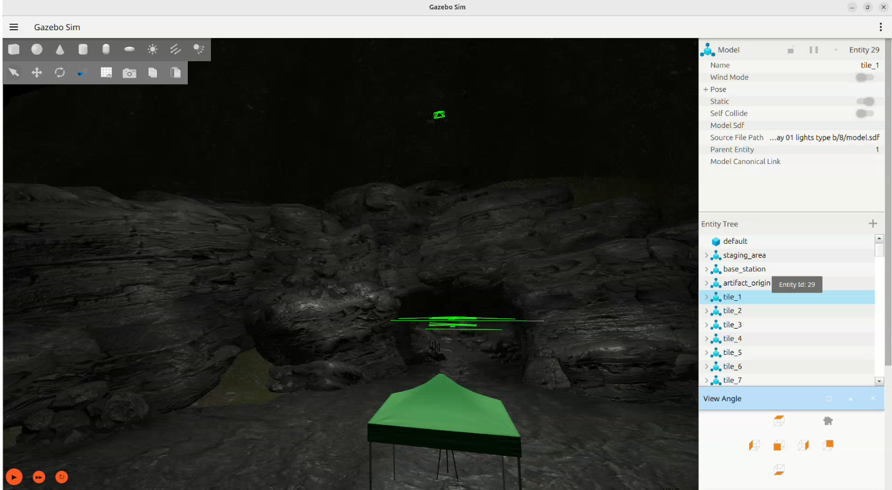

# Example of custom cave environment

This document outlines the process used to create `cave_circuit_01_customized.sdf`, a modified version of the original SubT Challenge world. The goal is to provide a purely static and lightweight environment, ideal for navigation, mapping, or perception tasks without the overhead of dynamic elements. More models are coming.

---

## Simulation Preview



---

## Source Repository

The original SDF files for the SubT Challenge worlds were sourced from the official repository, which can be found here:

*   **[[Link to the official source repository here](https://github.com/osrf/subt/tree/master/subt_ign/worlds)]**

---

## Modifications Made

To optimize performance and focus on a static environment, the following changes were implemented:

### 1. Removal of Dynamic and Superfluous Content

All elements not part of the cave's physical, static structure were removed to significantly reduce load times and resource consumption (CPU and RAM).

*   **Dynamic Obstacles (Rock Falls):** All four rockfall systems were eliminated. This included the `performer_detector` models and the `TriggeredPublisher` plugins responsible for activating them.
*   **Mission Artifacts & Objects:** All non-structural objects were removed, such as helmets, ropes, backpacks, rescue mannequins, and cell phones.
*   **Level Management System:** The entire `plugin` that managed loading entities by levels was removed. This plugin acted as a performance optimization, dynamically loading sections of the world only when the robot was nearby. It was removed to ensure a fully static and predictable environment.

### 2. Model URI Correction

A minor but critical adjustment was made to the file. During testing, it was noted that some model URIs were malformed and pointed to an incorrect web address, causing the simulation to fail.

An example of this was the model on line 911, which was repaired to point to the correct.
    *   **Incorrect:** `<uri>https.ignitionrobotics.org/1.0/OpenRobotics/models/Cave Elevation Type B</uri>`
    *   **Corrected:** `<uri>https://fuel.ignitionrobotics.org/1.0/OpenRobotics/models/Cave Elevation Type B</uri>`

---

## How to Run the Simulation

Follow these steps to launch the custom cave environment.

### Prerequisites

*   A working installation of **Gazebo Harmonic**.

### Launch Command

Open a terminal whre the model is located, otherwise use an absolute path and execute the following command:

```bash
gz sim cave_circuit_01_customized.sdf
```

> **ℹ️ Note on the First Launch**
> The **very first time** you run this command, Gazebo will need to download all the 3D cave models from the Ignition Fuel cloud. This process may take several minutes, and the Gazebo window may appear blank or unresponsive. This is normal. Subsequent launches will be much faster as the models will be loaded from a local cache.

Añadir al README de worlds en el repositorio esto:

## Datos externos

La carpeta `models` no está incluida en el repositorio por su tamaño.  
Para descargarla, este es el link del drive: [models](https://drive.google.com/drive/folders/1D0uMG3MZIO2is2i8dGqfqB7Hk6dC9R9_)

Esta carpeta debe estar dentro de `src/quadruped_sim/worlds`